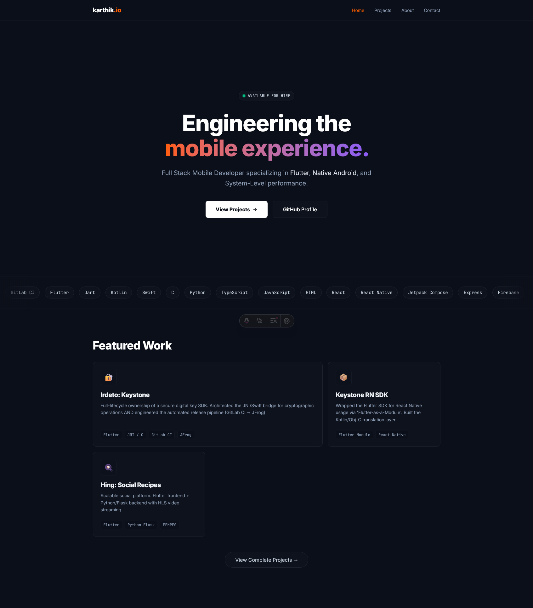

# karthik.io (Technical Dossier)


> **"Void Main"**: The entry point to my professional life.

A high-performance, dark-themed developer portfolio built to showcase mobile architecture, systems programming, and agentic AI projects. Designed with a "Cosmic Minimalist" aesthetic using the **Island Architecture** pattern for zero-javascript defaults.



## ⚡ Features

- **Island Architecture:** Zero client-side JavaScript by default, hydrating only interactive components.
- **Bento Grid Layout:** Modular, responsive grid system for showcasing technical projects.
- **Cosmic Theme:** Custom Tailwind v4 color palette (`astro-900`, `accent-primary`) with CSS-native gradients.
- **Infinite Marquee:** CSS-only horizontal scrolling tech stack using glassmorphism capsules.
- **Type-Safe Content:** Data schemas defined via TypeScript interfaces.

## 🛠️ Tech Stack

- **Core:** [Astro 5.0](https://astro.build)
- **Styling:** [Tailwind CSS v4](https://tailwindcss.com) (configured via CSS variables)
- **Scripting:** TypeScript
- **Components:** React 19 (for stateful UI elements)
- **Typography:** Inter (UI) & JetBrains Mono (Code)
- **Icons:** Lucide React / SVG

## 🚀 Getting Started

### Prerequisites

- Node.js 18+
- npm or pnpm

### Installation

1. **Clone the repository**

    ```bash
    git clone [https://github.com/AxelBlaz3/karthik.io.git](https://github.com/AxelBlaz3/karthik.io.git)
    cd karthik.io
    ```

2. **Install dependencies**

    ```bash
    npm install
    ```

3. **Run the development server**

    ```bash
    npm run dev
    ```

    Access the site at `http://localhost:4321`.

## 📂 Project Structure

```text
/
├── public/             # Static assets (images, fonts)
├── src/
│   ├── components/     # Reusable UI (Navbar, BentoItem, etc.)
│   ├── layouts/        # Page wrappers (Layout.astro)
│   ├── pages/          # Route definitions (index, about, projects)
│   ├── styles/         # Global CSS & Tailwind @theme config
│   └── env.d.ts        # TypeScript declarations
├── astro.config.mjs    # Astro configuration
└── package.json        # Dependencies
